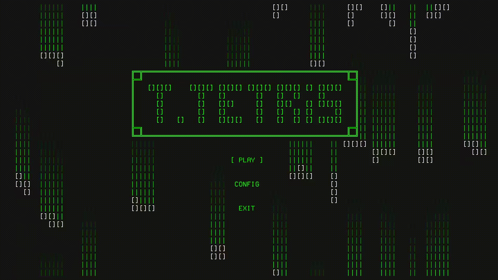

# T.Tetris

Tetris en la terminal, inspirado en las primeras versiones. Es compatible con **Linux** y
**Windows**. Esta 100% programado en **Go** usando la librería **tcell** para la interfaz



### Indices

- [Caracteristicas](#caracteristicas)
- [Recomendaciones](#recomendaciones)
- [Instación](#instalación)

## Caracteristicas

Está limitado a caracteres ASCII para soportar fuentes antiguas, los cambios de velocidad y el
sistema de puntuacion es igual al original: <br>

| Lineas |  Puntuacion  |
| :----: | :----------: |
|   1    |  40 x Nivel  |
|   2    | 100 x Nivel  |
|   3    | 300 x Nivel  |
|   4    | 1200 x Nivel |

Tambien tiene una tabla de puntuaciones local.

## Recomendaciones

Como minimo se recomienda una pantalla de **60x22**, pero lo ideal es **90x30** o mas.

En cuanto a las fuentes, si queres algo muy retro te recomiendo una fuentes de tipo **VGA** como
las **IBM BIOS**, estas fuentes las podes encontrar en [Oldschool PC Fonts](https://int10h.org/oldschool-pc-fonts/). Si queres algo
mas moderno podes usar una **NERD FONT** pixelada, como la **GohuFont 14 Nerd Font Mono** que es la
que se usa en la previsualizacion, estas las encontrar en [Nerd Fonts](https://www.nerdfonts.com/font-downloads)

Para la terminal se puede usar cualquiera pero se recomiendan terminales con soporte a 256 colores,
las recomendadas para Linux son **Alacritty** y **Kitty**.

## Instalación

> [!NOTE]
> Si tu sistema operativo o arquitectura no permite ejecutarlo, agradeceria que lo reportes en la
> parte de [Issues](https://github.com/FranciscoRatti/T.Tetris/issues) de GitHub.

- [Linux](#linux)
- [Windows](#windows)
- [Source Code](#source-code)

<br>

### Linux

Descarga el archivo **[TTetris.zip](https://raw.githubusercontent.com/FranciscoRatti/T.Tetris/main/TTetris-linux.zip)**
que contiene todos los archivos necesarios para la instalación, desde github o usando curl:

```shell
curl -L -O https://github.com/FranciscoRatti/T.Tetris/releases/download/latest/TTetris-linux.zip
```

Descomprimís el archivo con:

```shell
unzip TTetris-linux.zip -d TTetris && rm TTetris-linux.zip
```

Dentro del directorio _TTetris/shell/_ podés encontrar un script de instalación llamado
**install.sh**, simplemente ejecútalo usando:

```shell
./TTetris/shell/install.sh
```

Por ultimo podes borrar los archivos descargados ejecutando:

```shell
rm -rf TTetris
```

Para ejecutarlo podes usar el menu de aplicaciones, que abrira el juego en la terminal
predeterminada, o en cualquier terminal ejecutar:

```shell
tetris
```

Para **DESINSTALAR** el tetris debes borrar los archivos que se copian con el instalador.

```shell
sudo rm -R /usr/share/ttetris /usr/bin/tetris /usr/share/applications/ttetris.desktop ~/.config/ttetris
```

<br>

### Windows

Se recomienda ejecutar los siguientes comandos en **CMD**, no en ~PowerShell~. <br>
Primero descarga el archivo **[TTetris.zip](https://raw.githubusercontent.com/FranciscoRatti/T.Tetris/main/TTetris-windows.zip)**
que contiene todos los archivos necesarios para la instalación, desde github o usando curl:

```
curl -o TTetris-windows.zip https://github.com/FranciscoRatti/T.Tetris/releases/download/latest/TTetris-windows.zip
```

Descomprimís el archivo con:

```
mkdir TTetris && tar -xf TTetris-windows.zip -C "TTetris" && del TTetris-windows.zip
```

Dentro del directorio _TTetris/shell/_ podés encontrar un script de instalación llamado
**install.cmd**, simplemente ejecútalo usando:

```
.\TTetris\shell\install.cmd
```

Por último podés borrar los archivos descomprimidos ejecutando:

```
rmdir /s /q TTetris
```

Para ejecutarlo podes usar el menu de aplicaciones, que abrira el juego en la terminal
predeterminada, o en cualquier terminal ejecutar:

```
tetris
```

Para **DESINSTALAR** el tetris puedes ejecutar el desinstalador:

```
"%ProgramFiles%\TTetris\uninstall.cmd"
```

<br>

### Source Code

Podes compilar y ejecutar el proyecto en tu máquina, antes debes tener instalado **golang**. Luego
cloná el repositorio:

```shell
git clone https://github.com/FranciscoRatti/T.Tetris.git
```

Para compilar puedes ejecutar:

```shell
go build src/Main.go
```

Antes de ejecutar el binario hay tres cosas que debes de tener en cuenta:

- Donde irán los **archivos estáticos**, estos son los audios y el icono, (png o ico). Los audios
  tienen que ir dentro de un subdirectorio llamado **audio**
- Donde irá el archivo de **configuración**.
- Donde irá el archivo que guarda el scoreboard llamado **scoreboard.obj**.

Luego de tener esto claro, es necesario especificar estos tres paths incluyendo los siguientes
parámetros en cualquier orden al ejecutar el binario:

```shell
[ejecutable] --resources [path] --config [path] --var [path]
```

Si estas en el directorio del repositorio podes remplazar las tres veces que aparece **[path]** por
**resources/** porque en el repositorio los archivos estáticos, la config y scoreboard.obj estan en
ese directorio.

Para ejecutar sin compilar podes ejecutar el mismo comando anterior remplazando **[ejecutable]** por
**go run src/Main.go**
