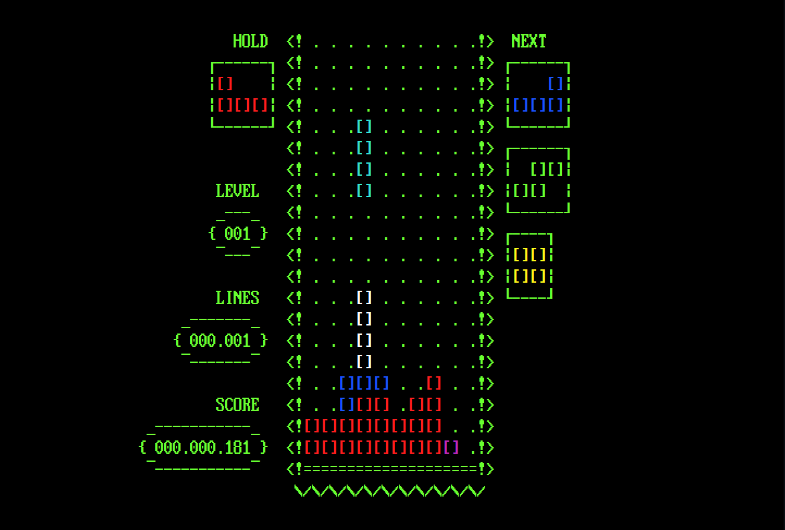

# T.Tetris

Tetris en la terminal, pensado para usarse en la TTY de linux, inspirado en las primeras versiones.
Es compatible con **Linux** y **Windows**.



### Indices

- [Caracteristicas](#caracteristicas)
- [Recomendaciones](#recomendaciones)
- [Instación](#instalación)

## Caracteristicas

Está limitado a caracteres ASCII para soportar fuentes antiguas, los cambios de velocidad y el
sistema de puntuacion es igual al original: <br>

| Lineas |  Puntuacion  |
|:------:|:------------:|
|   1    |  40 x Nivel  |
|   2    | 100 x Nivel  |
|   3    | 300 x Nivel  |
|   4    | 1200 x Nivel |

## Recomendaciones

Como minimo se recomienda una pantalla de **60x22**, pero lo ideal es **90x30** o mas.

En cuanto a las fuentes se recomiendan fuentes de tipo **VGA** como las **IBM BIOS**, la que se usa
en la vista previa es la **AcPlus IBM VGA 8x16**. Estas fuentes las puedes encontrar en
[Oldschool PC Fonts](https://int10h.org/oldschool-pc-fonts/)

Para la terminal se puede usar cualquiera, las recomendadas para Linux son **XTerm**, **Alacritty**,
**Kitty** o la **TTY** nativa.

## Instalación

- [Linux](#linux)
- [Windows](#windows)

### Linux

Descarga el archivo **[TTetris.zip](https://raw.githubusercontent.com/FranciscoRatti/T.Tetris/main/TTetris-linux.zip)**
que contiene todos los archivos necesarios para la instalacion, desde github o usando curl:

```
curl -L -O https://github.com/FranciscoRatti/T.Tetris/releases/download/latest/TTetris-linux.zip
```

Descomprimís el archivo con:

```
unzip TTetris-linux.zip -d TTetris && rm TTetris-linux.zip
```

Dentro del directorio _TTetris/shell/_ podés encontrar un script de instalación llamado
**install.sh**, simplemente ejecútalo usando:

```
./TTetris/shell/install.sh
```

Por ultimo podes borrar los archivos descargados ejecutando:

```
rm -rf TTetris
```

Para ejecutarlo podes usar el menu de aplicaciones, que abrira el juego en la terminal
predeterminada, o en cualquier terminal ejecutar:

```
tetris
```

Para **DESINSTALAR** el tetris debes borrar los archivos que se copian con el instalador.

```
sudo rm -R /usr/share/ttetris /usr/bin/tetris /usr/share/applications/ttetris.desktop ~/.config/ttetris
```

### Windows

Descarga el archivo **[TTetris.zip](https://raw.githubusercontent.com/FranciscoRatti/T.Tetris/main/TTetris-windows.zip)**
que contiene todos los archivos necesarios para la instalación, desde github o usando curl:

```
curl -o TTetris-windows.zip https://github.com/FranciscoRatti/T.Tetris/releases/download/latest/TTetris-windows.zip
```

Descomprimís el archivo con:

```
mkdir TTetris && tar -xf TTetris-windows.zip -C "TTetris" && del TTetris-windows.zip
```

Dentro del directorio _TTetris/shell/_ podés encontrar un script de instalación llamado
**install.cmd**, simplemente ejecútalo usando:

```
.\TTetris\shell\install.cmd
```

Por último podés borrar los archivos descomprimidos ejecutando:

```
rmdir /s /q TTetris
```

Para ejecutarlo podes usar el menu de aplicaciones, que abrira el juego en la terminal
predeterminada, o en cualquier terminal ejecutar:

```
tetris
```

Para **DESINSTALAR** el tetris puedes ejecutar el desinstalador:

```
"%ProgramFiles%\TTetris\uninstall.cmd"
```